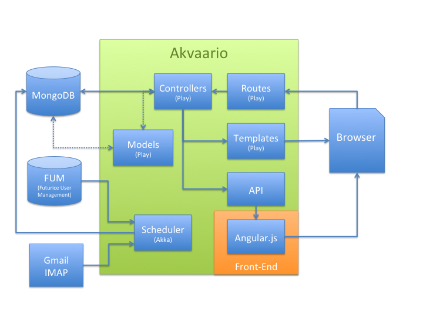

# Akvaario Customer Window

## What is Akvaario?

Akvaario is a dashboard that gathers project information. It improves transparency by offering customers a proper image of project and product status with a quick view.

Akvaario is not a two-way communication tool and should complement, not replace, the current communication channels. Although communication through Akvaario isn’t in both ways it supports the communication process at least in the five following ways:

**a) Increases visibility:** Makes customers more aware of the project status, and thus increase trust and ease decision making.

**b) Automates informal reporting:** Eases the System manager's workload by offering up-to-date information.

**c) Highlights meaningful information:** Allows both the customer and Futurice to form a more complete image of the overall situation, and reduces information overflow.

**d) Gives clearer overview:** Gives a quick overview of tools and Systems used, as well as the people involved in a project, to e.g. a new project member.

(Possibly in the future - Introduces additional value-adding FutuSystems: Shows Systems that the customer has not yet purchased but can be integrated with Akvaario to create additional value.)

## Who did this?

The origins of Akvaario are shrouded in mystery, but legend says that the idea was forged in the mythical cave of LCM.

More recently, the idea was used in the Aalto University course T-76.4115 Software Development Project as a student project. 

The students who worked on it were:
* [Christian Arrhenius](https://github.com/carrheni) PM
* [Oskar Ehnström](https://github.com/Ozzee) QA
* [Raoul Udd](https://github.com/rrudd) Architect
* [Patrik Carlson](https://github.com/patrikcarlson)
* [Nicolas Dolenc](https://github.com/NicolasDolenc)
* [Valter Kraemer](https://github.com/valterkraemer)
* [Nestor Köhler](https://github.com/nkohler)
* [Niklas Lindroos](https://github.com/nlindroos)
* [Jussi Paakkola](https://github.com/morakh)

## Development

For developing you need the following:

* [Play 2.2.x](http://www.playframework.com)
* [MongoDB](https://www.mongodb.org/)
* [Pybot & Selenium](docs/robot.md) (for front-end testing)

More comprehensive guides for installing the environment are available for: [Mac OS X](docs/installation_mac.md), [Linux](docs/installation_linux.md) and [Windows](docs/installation_windows.md). 

### Architecture

. 

A more thorough guide to the architecture can be found in the [Anatomy of Akvaario](docs/architecture_anatomy.md)

### Testing

This project uses the built-in Play testing framework as well as end-to-end tests using the robot framework and selenium. This section goes through the Play-tests. See [this guide](docs/robot.md) for more information about the robot tests.

Start by opening the play console:

	$ play
	
The following commands should be run either in the Play! console or by adding "play" before them and running in the terminal.
	
To clean the project before running it:

	clean

To run the tests:

	test

For code coverage report, run:

	scoverage:test

The resulting html report will be in target/scala-2.10/scoverage-report

The tests are located in the /test-folder.

*The securesocial-folder is included as the test framework for that particular plug-in was not included in the latest builds at the time of writing. It should be removed as soon as the test-framework is included in the official build of securesocial.*

### Environment settings

The credentials addresses for certain services should be stored in separate configuration files and not stored in VC. To use these configurations you need to specify the configuration files Play! should use.

When running/starting play the correct conf-file can be set by running the following command

	play -Dconfig.resource=DESIRED_ENVIRONMENT.conf

Followed by the desired command (start/run/test etc.).

# Deployment

For a full deployment guide, see [deploy.md](docs/deploy.md). Apache example configurations may be found in [apache2.md](docs/apache2.md).

## Version Control

This project uses [git](http://git-scm.com/) and [git-flow](https://github.com/nvie/gitflow). A short introduction to git-flow in this project can be found [here](docs/git-flow.md).

## Useful commands

### Clear database

To drop all directories in the database, go to the project's root directory and enter the command

	mongo mongo/dropDB.js

## Analytics

This project uses [Google Analytics](http://www.google.com/analytics/). For a more comprehensive guide to the implementation, see [Google Analytics quick userguide](docs/google_analytics.md)

## Libraries used

### Front-end

* [AngularJS](http://angularjs.org/) MIT License
* [Bootstrap](http://getbootstrap.com/) MIT License
* [UI Bootstrap](http://angular-ui.github.io/bootstrap/) MIT License
* [jQuery](http://jquery.com/) MIT License
* [Google Analytics](http://www.google.com/analytics/)
* [Dimple](http://dimplejs.org) MIT License
* [D3](http://d3js.org) BSD 3-Clause License
* [Font Awesome](http://fontawesome.io) MIT License

### Play Framework

* [Play Framework](http://www.playframework.com/) Apache 2 License
* [ReactiveMongo](http://reactivemongo.org/) Apache 2 License
* [FixturesPlugin.scala](https://github.com/schleichardt/play-2-mongodb-app) Apache 2 License
* [MongoUserService.scala](https://github.com/sarchak/CrowdSource) 

### Testing

* [Robot framework](http://robotframework.org/) Apache 2 License
* [Selenium](http://docs.seleniumhq.org/)

## License

MIT License (MIT)

Copyright (c) 2014 Futurice Oy

Permission is hereby granted, free of charge, to any person obtaining a copy
of this software and associated documentation files (the "Software"), to deal
in the Software without restriction, including without limitation the rights
to use, copy, modify, merge, publish, distribute, sublicense, and/or sell
copies of the Software, and to permit persons to whom the Software is
furnished to do so, subject to the following conditions:

The above copyright notice and this permission notice shall be included in
all copies or substantial portions of the Software.

THE SOFTWARE IS PROVIDED "AS IS", WITHOUT WARRANTY OF ANY KIND, EXPRESS OR
IMPLIED, INCLUDING BUT NOT LIMITED TO THE WARRANTIES OF MERCHANTABILITY,
FITNESS FOR A PARTICULAR PURPOSE AND NONINFRINGEMENT. IN NO EVENT SHALL THE
AUTHORS OR COPYRIGHT HOLDERS BE LIABLE FOR ANY CLAIM, DAMAGES OR OTHER
LIABILITY, WHETHER IN AN ACTION OF CONTRACT, TORT OR OTHERWISE, ARISING FROM,
OUT OF OR IN CONNECTION WITH THE SOFTWARE OR THE USE OR OTHER DEALINGS IN
THE SOFTWARE.
